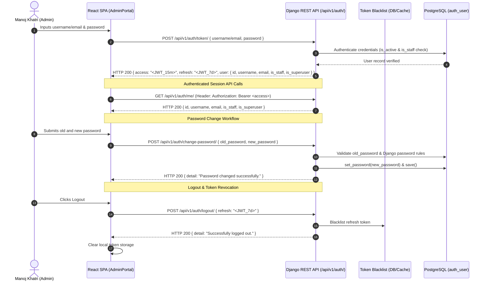

# Phase 3 — Authentication & Security Architecture Plan

## 1. Current Authentication State

The frontend currently operates in a multi-tier authentication mode:
1. **Firebase Authentication SDK (`src/firebase.ts`)**: Optional client-side authentication against Firebase Auth (email/password).
2. **Local Demo Authentication (`src/pages/AdminPortal.tsx`)**: Fallback mock user session when backend services are unconfigured.
3. **Django API Client (`src/lib/djangoApi.ts`)**: Prototype client that authenticates against Django SimpleJWT endpoint (`/api/token/` or `/api/v1/auth/token/`), storing tokens and sending Bearer authorization headers.

The goal of Phase 3 is to establish the production-grade, secure **Django REST Framework SimpleJWT** authentication subsystem without removing or breaking existing frontend fallbacks.

---

## 2. Proposed Authentication Architecture

---

## 3. Target Endpoint Contract

| HTTP Method | URL Path | Auth Required | Purpose | Payload / Parameters | Success Response |
|---|---|---|---|---|---|
| **POST** | `/api/v1/auth/token/` | Public | Login / Issue JWT pair | `{ "username": "...", "password": "..." }` | `200 OK` `{ "access": "...", "refresh": "...", "user": {...} }` |
| **POST** | `/api/v1/auth/token/refresh/` | Public (Refresh Token) | Rotate / Refresh access token | `{ "refresh": "..." }` | `200 OK` `{ "access": "...", "refresh": "..." }` |
| **POST** | `/api/v1/auth/token/verify/` | Public | Verify token validity | `{ "token": "..." }` | `200 OK` `{}` |
| **POST** | `/api/v1/auth/logout/` | Authenticated (Bearer) | Blacklist refresh token | `{ "refresh": "..." }` | `200 OK` `{ "detail": "Successfully logged out." }` |
| **GET** | `/api/v1/auth/me/` | Authenticated (Bearer) | Fetch current user profile | Header: `Authorization: Bearer <token>` | `200 OK` `{ "id": 1, "username": "...", "email": "...", "is_staff": true }` |
| **POST** | `/api/v1/auth/change-password/` | Authenticated (Bearer) | Change admin password | `{ "old_password": "...", "new_password": "..." }` | `200 OK` `{ "detail": "Password updated successfully." }` |

---

## 4. Permission Model

* **Public Read Endpoints**: `AllowAny` (Projects showcase, skills, experience, blog, public resume streaming, contact form submission).
* **Administrative Operations**: `IsAdminUser` / `IsAuthenticated` (CMS updates, inquiry triage, active resume file upload, password changes).
* Standard Django `is_staff` and `is_superuser` flags control access to back-office endpoints.

---

## 5. Token Strategy

1. **Access Token Lifespan**: 15 minutes (`timedelta(minutes=15)`).
2. **Refresh Token Lifespan**: 7 days (`timedelta(days=7)`).
3. **Token Rotation**: `ROTATE_REFRESH_TOKENS = True` (A new refresh token is issued when refreshing).
4. **Token Blacklisting**: `BLACKLIST_AFTER_ROTATION = True` (Old refresh tokens are automatically added to the blacklist).
5. **Signing Algorithm**: HMAC-SHA256 (`HS256`) using Django `SECRET_KEY`.
6. **JWT Claims**: Minimal safe payload (`user_id`, `token_type`, `exp`, `iat`, `jti`). Passwords and sensitive internal keys are never embedded.

---

## 6. Frontend Integration Strategy

* **Token Storage**: Stored in `localStorage` or `sessionStorage` under `portfolio_django_access_token` and `portfolio_django_refresh_token` as configured in `src/lib/djangoApi.ts`.
* **Transparent Refresh**: When API requests receive `HTTP 401 Unauthorized`, the client automatically calls `/api/v1/auth/token/refresh/` using the stored refresh token.
* **Fallback Preservation**: Existing Firebase Auth and offline demo fallbacks are kept intact for resilient offline previews.

---

## 7. Security Considerations

* **Password Validation**: Validated against Django's `MinimumLengthValidator` (min 8 chars), `UserAttributeSimilarityValidator`, `CommonPasswordValidator`, and `NumericPasswordValidator`.
* **Zero Secret Leakage**: No passwords or hashes are returned in API responses or logged in stdout/stderr.
* **CORS & CSRF**: CORS headers strictly restrict origins to `http://localhost:3000`, `http://127.0.0.1:3000`, and `https://manojkc1.com.np`.
* **Throttling**: DRF standard scoping for authentication views prevents brute-force attempts.

---

## 8. Migration Considerations

* Add `apps.authentication` to `LOCAL_APPS`.
* Add `rest_framework_simplejwt` and `rest_framework_simplejwt.token_blacklist` to `INSTALLED_APPS`.
* Apply database migrations for `token_blacklist`.

---

## 9. Testing Plan

1. **Login Tests**:
   - Authenticate with valid username or email.
   - Reject invalid password with 401 Unauthorized.
   - Inactive user cannot authenticate.
2. **Refresh Tests**:
   - Valid refresh token issues new access token.
   - Invalid or expired refresh token returns 401.
3. **Logout & Blacklist Tests**:
   - Logout blacklists refresh token.
   - Blacklisted refresh token cannot be reused to obtain new access tokens.
4. **`/auth/me/` Tests**:
   - Returns safe profile for authenticated user.
   - Blocks unauthenticated requests with 401.
5. **Password Change Tests**:
   - Successful password change with valid current password.
   - Rejection when current password is incorrect.
   - Rejection when new password violates Django validation rules (e.g. too short or purely numeric).
   - Old password no longer works; new password authenticates successfully.
