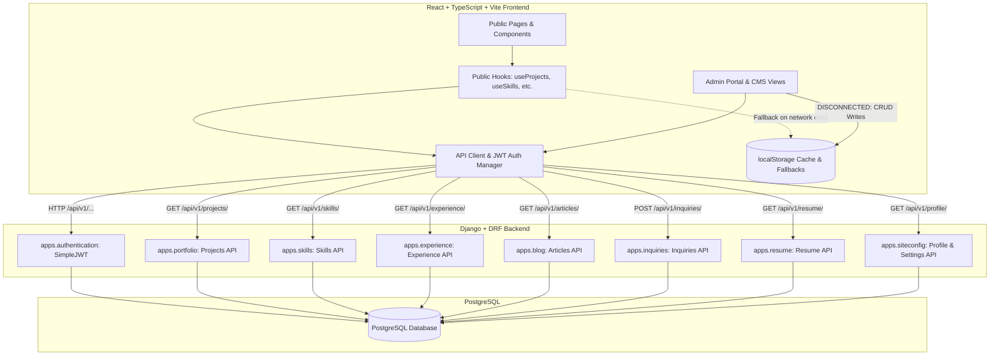

# Phase 5C — Integration Hardening & Architecture Audit

**Project:** Manoj Khatri Portfolio (`manojkcportfolio`)  
**Date:** October 2026  
**Branch:** `feature/phase-5b-api-integration`  
**Current HEAD:** `c9dde74`  
**Audit Scope:** Read-Only Audit of React Frontend ↔ Django REST Framework Backend Integration  

---

## 1. Executive Summary

This document presents the comprehensive, read-only architectural audit of the integration between the React + TypeScript frontend and the canonical Django REST Framework (DRF) backend for the Manoj Khatri personal portfolio.

### Summary of Current State:
* **Public Frontend:** Successfully migrated to Django REST API for Projects, Experience, Skills, Uses, Profile, and Writing/Articles. All public hooks follow a resilient pattern: DRF API first $\rightarrow$ static fallback on failure.
* **Authentication:** Django SimpleJWT is now canonical (`POST /api/v1/auth/token/`, `POST /api/v1/auth/token/refresh/`, `GET /api/v1/auth/me/`). Auth client in `src/lib/api/client.ts` implements automatic 401 interceptor with token refresh deduplication.
* **Admin Portal:** Admin authentication supports Django JWT, but Admin CMS CRUD operations (`ProjectsView`, `SkillsView`, `ExperienceView`, `InquiriesView`, `AboutView`, `SocialsView`) remain **completely decoupled** from the Django backend, writing only to browser `localStorage` or legacy endpoints.
* **Legacy Artifacts:** Remaining calls to legacy endpoints (`/api/messages`), residual Firebase SDK usages (`src/firebase.ts`, `src/lib/resume/storage.ts`), and type schema divergences between `AdminProject` and public `Project`.
* **Test Suite:** 140/140 frontend tests passing, 82/82 backend tests passing, 0 Django check issues.

---

## 2. Current Architecture Overview



---

## 3. Complete API Integration Matrix

| Resource / Endpoint | HTTP Method | Auth Required | Frontend Client Function | Current Status | Notes / Gaps |
| :--- | :--- | :--- | :--- | :--- | :--- |
| `/api/v1/auth/token/` | POST | Public | `loginWithCredentials` | ✅ Integrated | Canonical JWT issue |
| `/api/v1/auth/token/refresh/` | POST | Public (Refresh) | `refreshAccessToken` | ✅ Integrated | Auto-refresh interceptor |
| `/api/v1/auth/token/verify/` | POST | Public | `verifyToken` | ✅ Available | In `src/lib/api/auth.ts` |
| `/api/v1/auth/me/` | GET | Bearer JWT | `getCurrentUser` | ✅ Integrated | Session bootstrap |
| `/api/v1/auth/change-password/`| POST | Bearer JWT | `updatePassword` | ✅ Integrated | In `SettingsView` |
| `/api/v1/profile/` | GET | Public | `getProfile` | ✅ Integrated | Backs `useProfile` |
| `/api/v1/projects/` | GET | Public | `getProjects` | ✅ Integrated | Backs `useProjects` |
| `/api/v1/projects/<slug>/` | GET | Public | `getProject` | ✅ Integrated | Backs `useProject` |
| `/api/v1/skills/` | GET | Public | `getSkills` | ✅ Integrated | Backs `useSkills` |
| `/api/v1/experience/` | GET | Public | `getExperience` | ✅ Integrated | Backs `useExperience` |
| `/api/v1/experience/<id>/` | GET | Public | `getExperienceDetail`| ✅ Available | In `src/lib/api/public.ts` |
| `/api/v1/articles/` | GET | Public | `getArticles` | ✅ Integrated | Backs `useWriting` |
| `/api/v1/articles/<slug>/` | GET | Public | `getArticle` | ✅ Integrated | Backs `useArticle` |
| `/api/v1/uses/` | GET | Public | `getUses` | ✅ Integrated | Backs `useUses` |
| `/api/v1/currently-building/` | GET | Public | `getCurrentlyBuilding`| ✅ Available | In `src/lib/api/public.ts` |
| `/api/v1/resume/` | GET | Public | `getActiveResumeData` | ✅ Integrated | Public resume preview |
| `/api/v1/inquiries/` | POST | Public (+Honeypot)| `submitInquiry` | ✅ Integrated | Contact form submission |
| `/api/v1/inquiries/` | GET | Bearer JWT | *None* | ❌ Missing in Frontend | Admin reads `/api/messages` |
| `/api/v1/inquiries/<id>/` | PATCH/DELETE | Bearer JWT | *None* | ❌ Missing in Frontend | Admin deletes via `/api/messages?id=` |
| `/api/v1/admin/projects/` | GET/POST | Bearer JWT | *None* | ❌ Missing in Frontend | Admin uses `localStorage` |
| `/api/v1/admin/projects/<id>/`| PUT/PATCH/DELETE| Bearer JWT | *None* | ❌ Missing in Frontend | Admin uses `localStorage` |
| `/api/v1/admin/skills/` | POST/PUT | Bearer JWT | *None* | ❌ Missing in Frontend | Admin uses `localStorage` |
| `/api/v1/admin/experience/` | POST/PUT/DELETE | Bearer JWT | *None* | ❌ Missing in Frontend | Admin uses `localStorage` |

---

## 4. Public API Matrix

All public hooks follow the canonical resilience pattern:
1. Initialize with static data for immediate first-paint (0 layout shift).
2. Fetch live data from Django API with `AbortController` cancellation on unmount.
3. Replace with live API data on 200 OK.
4. Keep static fallback intact on network error without throwing uncaught UI exceptions.

| Public Page / Component | Primary Hook | API Endpoint | Fallback Data Source |
| :--- | :--- | :--- | :--- |
| `Hero`, `Footer`, `SocialLinks` | `useProfile` | `GET /api/v1/profile/` | `src/data/profile.ts` |
| `ProjectsPage`, `FeaturedProjects` | `useProjects` | `GET /api/v1/projects/` | `src/data/projects.ts` |
| `CaseStudyPage` (`/projects/:id`) | `useProject` | `GET /api/v1/projects/<slug>/` | `src/data/projects.ts` |
| `SkillsPage`, `SkillsSection` | `useSkills` | `GET /api/v1/skills/` | `src/data/skills.ts` |
| `ExperiencePage`, `Timeline` | `useExperience` | `GET /api/v1/experience/` | `src/data/experience.ts` |
| `WritingPage`, `BlogPage` | `useWriting` | `GET /api/v1/articles/` | `src/data/writing.ts` |
| `WritingPostPage` (`/writing/:slug`) | `useArticle` | `GET /api/v1/articles/<slug>/` | `src/data/writing.ts` |
| `UsesPage` (`/uses`) | `useUses` | `GET /api/v1/uses/` | `src/data/uses.ts` |
| `ContactPage`, `ContactModal` | Direct API | `POST /api/v1/inquiries/` | In-memory feedback toast |

---

## 5. Admin API Matrix & Current Disconnect

| Admin View | Read Source (Current) | Write Source (Current) | Target Canonical DRF Endpoint | Gap Severity |
| :--- | :--- | :--- | :--- | :--- |
| `DashboardView` | Props (`AdminPortal` state) | N/A | Calculated / DRF Dashboard stats | LOW |
| `ProjectsView` | `localStorage('admin_cms_projects')` | `localStorage('admin_cms_projects')` + `localStorage('portfolio_projects')` | `GET/POST/PUT/DELETE /api/v1/projects/` (or admin viewset) | **CRITICAL** |
| `SkillsView` | `localStorage('portfolio_skills')` | `localStorage('portfolio_skills')` | `GET/POST/PUT /api/v1/skills/` | **HIGH** |
| `ExperienceView` | `localStorage('portfolio_experience')` | `localStorage('portfolio_experience')` | `GET/POST/PUT/DELETE /api/v1/experience/` | **HIGH** |
| `InquiriesView` | `fetch('/api/messages')` + `localStorage('admin_inquiries')` | `fetch('/api/messages')` + `localStorage` | `GET/PATCH/DELETE /api/v1/inquiries/` | **HIGH** |
| `AboutView` | `localStorage('portfolio_about_content')` | `localStorage('portfolio_about_content')` | `GET/PUT /api/v1/profile/` | **MEDIUM** |
| `SocialsView` | `localStorage('portfolio_social_links')` | `localStorage('portfolio_social_links')` | `GET/PUT /api/v1/siteconfig/socials/` | **MEDIUM** |
| `ResumeView` | `localStorage('portfolio_resumes_v2')` + Firestore | `localStorage` + Firestore | `GET/POST/PUT /api/v1/resume/` | **MEDIUM** |
| `SettingsView` | `POST /api/v1/auth/change-password/` | Django API | `POST /api/v1/auth/change-password/` | ✅ **Synced** |

---

## 6. Authentication Flow Audit

### Current Authentication Architecture:
1. **Login:** User submits credentials $\rightarrow$ `loginWithCredentials(username, password)` $\rightarrow$ `POST /api/v1/auth/token/`. Tokens (`portfolio_django_access_token`, `portfolio_django_refresh_token`) stored securely in `localStorage`.
2. **Session Bootstrap:** On `AdminPortal` mount, `getCurrentUser()` calls `GET /api/v1/auth/me/` using stored access token. If valid (200 OK), authenticated state is confirmed.
3. **Auto-Refresh Interceptor (`authRequest`):**
   * If a request returns HTTP 401, `authRequest` triggers `refreshAccessToken()` with `POST /api/v1/auth/token/refresh/`.
   * Concurrency is handled cleanly via `_refreshPromise` memoization (all simultaneous requests wait for a single refresh call).
   * On successful refresh, new access token is stored and the original failed request is retried once.
   * On refresh failure (HTTP 401/400), tokens are cleared, `portfolio_auth_unauthorized` window event is dispatched, and user is redirected to login view.
4. **Fallback & Demo Support:** Firebase Auth remains available if Firebase credentials are provided in `.env`. Demo login (`handleQuickDemoAccess`) is preserved for preview environments.

---

## 7. Remaining Legacy Dependencies Audit

### 7.1 `/api/messages` Investigation
* **Occurrences in Codebase:**
  1. `src/pages/AdminPortal.tsx:380` (`syncServerInquiries`): `fetch('/api/messages', { cache: 'no-store' })`
  2. `src/pages/AdminPortal.tsx:574` (`handleDeleteInquiry`): `fetch('/api/messages?id=' + id, { method: 'DELETE' })`
  3. `src/pages/admin/views/InquiriesView.tsx:118` (`handleCreateTestLead`): `fetch('/api/messages', { method: 'POST', ... })`
* **Root Cause:** `/api/messages` was a legacy mock route from pre-Django development. In production or test environments (such as Node `jsdom`), relative URLs without base origin fail with `TypeError: Failed to parse URL from /api/messages`.
* **Remediation:** Replace all `/api/messages` calls with canonical DRF endpoints:
  * Fetch leads $\rightarrow$ `GET /api/v1/inquiries/` (requires Bearer token)
  * Delete lead $\rightarrow$ `DELETE /api/v1/inquiries/<id>/` (requires Bearer token)
  * Update status $\rightarrow$ `PATCH /api/v1/inquiries/<id>/` (requires Bearer token)

### 7.2 Firebase SDK Audit
* **Files Referencing Firebase:**
  * `src/firebase.ts`: Direct imports from `firebase/app`, `firebase/auth`, `firebase/firestore`.
  * `src/pages/AdminPortal.tsx`: Imports Firebase auth hooks, Firestore `collection`, `getDocs`, `doc`, `updateDoc`.
  * `src/lib/resume/storage.ts`: Firestore CRUD for resume documents (`collection(db, 'resumes')`).
  * `src/lib/analytics.ts`: Firebase analytics event tracking.
* **Current Status:** Firebase operations are gated behind `isFirebaseConfigured` and environment variable checks. In the absence of Firebase configuration, the application safely skips Firestore and uses `localStorage`.
* **Risk:** Adds bundle size (~300KB) and potential confusion. Can be phased out once resume management is migrated to Django DRF.

### 7.3 `localStorage` State Audit
* `portfolio_projects` / `admin_cms_projects`: Used by admin projects view.
* `portfolio_skills` / `portfolio_current_focus`: Used by admin skills view.
* `portfolio_experience`: Used by admin experience view.
* `portfolio_resumes_v2`: Used by resume editor.
* `admin_inquiries`: Used by admin inquiry inbox.
* `portfolio_about_content` / `portfolio_social_links`: Used by about and socials views.
* **Risk:** High risk of data divergence where admin edits are stored only in client browser storage and never reflected in PostgreSQL or visible to public site visitors.

---

## 8. Data Schema & Model Divergence: `AdminProject` vs Public `Project`

There is a significant structural divergence between the admin interface project format (`AdminProject`) and the public/Django project format (`Project`):

| Property | `AdminProject` (`src/pages/admin/types.ts`) | Public `Project` (`src/types.ts`) | Django `Project` Model (`portfolio.models`) |
| :--- | :--- | :--- | :--- |
| Identifier | `id: string` (uuid or slug) | `id: string` (slug) | `id: UUID`, `slug: SlugField` |
| Tagline / Short Desc | `shortDescription: string`, `tagline?: string` | `tagline: string`, `description: string` | `tagline`, `short_description`, `description` |
| Technologies | `technologies: string[]` | `tech: string[]` | `technologies: string[]` |
| URLs / Links | `liveUrl?: string`, `githubUrl?: string` | `links: { live?: string, github?: string, ... }` | `live_url`, `github_url`, `case_study_url` |
| Thumbnail / Image | `thumbnail: string` | `image: string` | `image`, `thumbnail_url` |
| Highlights | `keyHighlights?: string` (string/newlines) | `highlights: string[]` (array) | `highlights: JSONField` (array) |
| Case Study Detail | `fullCaseStudy?: string` | Structured fields (`problem`, `solution`, `architecture`, `challenges`) | Structured fields + Markdown content |

* **Remediation Requirement:** A bidirectional adapter / mapper function must be established in `src/lib/api/` to seamlessly translate between `AdminProject` (CMS UI representation) and the Django DRF `ProjectSerializer` format.

---

## 9. Comprehensive Findings & Severity Classifications

```
[CRITICAL] = Immediate data integrity or architectural breakdown
[HIGH]     = Missing key functionality or broken endpoints in production
[MEDIUM]   = Schema divergences, legacy SDK bloat, or UI warnings
[LOW]      = Minor code style, formatting, or unused helper functions
```

### Finding F-01: Admin CMS CRUD Operations Completely Disconnected from Django
* **Severity:** **CRITICAL**
* **Affected Files:**
  * `src/pages/AdminPortal.tsx`
  * `src/pages/admin/views/ProjectsView.tsx`
  * `src/pages/admin/views/SkillsView.tsx`
  * `src/pages/admin/views/ExperienceView.tsx`
* **Current Behavior:** Changes made in the Admin Portal (adding/editing/deleting projects, updating skills, editing career milestones) are saved only to the admin's local browser `localStorage`.
* **Desired Behavior:** Admin actions send authenticated DRF API mutations (`POST`, `PUT`, `PATCH`, `DELETE`) with Bearer tokens to update PostgreSQL directly.
* **Minimal Fix:** Create admin API service methods in `src/lib/api/admin.ts` using `adminApiClient`, wire them into Admin CMS view save handlers, and reload state from Django on change.

---

### Finding F-02: Legacy `/api/messages` Endpoints in Admin Inquiries View
* **Severity:** **HIGH**
* **Affected Files:**
  * `src/pages/AdminPortal.tsx` (lines 380, 574)
  * `src/pages/admin/views/InquiriesView.tsx` (line 118)
* **Current Behavior:** Inquiries sync and deletion use relative URLs `/api/messages`, causing runtime exceptions in Node/jsdom tests and failing on production static hosting where no Express server exists.
* **Desired Behavior:** Use canonical Django endpoints `GET /api/v1/inquiries/` and `DELETE /api/v1/inquiries/<id>/` with JWT authentication.
* **Minimal Fix:** Add inquiry management methods (`listInquiries`, `deleteInquiry`, `updateInquiryStatus`) in `src/lib/api/inquiries.ts` and call them from `AdminPortal` and `InquiriesView`.

---

### Finding F-03: Type Mismatch Between `AdminProject` and Public/Django `Project`
* **Severity:** **CRITICAL** (for Admin CRUD integration)
* **Affected Files:**
  * `src/pages/admin/types.ts`
  * `src/types.ts`
  * `src/pages/admin/views/ProjectsView.tsx`
* **Current Behavior:** `AdminProject` uses flat property names (`technologies`, `liveUrl`, `githubUrl`, `thumbnail`) while `Project` uses nested structure (`tech`, `links.live`, `links.github`, `image`).
* **Desired Behavior:** Standardize on consistent transformer utilities `toAdminProject(drfProject)` and `toDjangoProjectPayload(adminProject)` to ensure clean serialization across admin forms.
* **Minimal Fix:** Create `src/lib/api/adapters/projectAdapter.ts` with explicit mapping and validation.

---

### Finding F-04: Test Suite `act(...)` State Update Warnings
* **Severity:** **MEDIUM**
* **Affected Files:**
  * `src/__tests__/FooterAndRouting.test.tsx`
  * `src/__tests__/Socials.test.tsx`
* **Current Behavior:** Asynchronous state resolutions in `useProfile` and `syncServerInquiries` trigger React DOM `not wrapped in act(...)` warnings during test runs.
* **Desired Behavior:** Async effects wrapped in `waitFor` or properly mocked in unit tests to ensure clean test runner output without warnings.
* **Minimal Fix:** Add proper MSW or Vitest `vi.spyOn` mocks for API calls in routing and footer test suites.

---

### Finding F-05: In-Function `setIsLoadingSafe` Helper in `useUses.ts`
* **Severity:** **LOW**
* **Affected Files:**
  * `src/hooks/useUses.ts`
* **Current Behavior:** Helper function defined inside hook body instead of module-level or standard `mountedRef` pattern.
* **Desired Behavior:** Clean unmount cancellation using `AbortController` consistent with `useProjects`, `useSkills`, and `useWriting`.
* **Minimal Fix:** Refactor `useUses.ts` to use `AbortController` cancellation matching other public hooks.

---

## 10. Prioritized Remediation & Implementation Plan

### Phase 5C Step 1: Inquiries Admin API Integration (Immediate Priority)
1. Add admin inquiry DRF endpoints in `src/lib/api/inquiries.ts`:
   * `getInquiries(options?: RequestOptions): Promise<AdminInquiry[]>`
   * `deleteInquiry(id: string, options?: RequestOptions): Promise<void>`
   * `updateInquiry(id: string, updates: Partial<AdminInquiry>, options?: RequestOptions): Promise<AdminInquiry>`
2. Replace `/api/messages` in `AdminPortal.tsx` and `InquiriesView.tsx`.
3. Verify inquiry inbox loads real submissions from PostgreSQL.

### Phase 5C Step 2: Projects Admin API Integration
1. Implement bidirectional `projectAdapter.ts` mapping `AdminProject` $\leftrightarrow$ DRF `ProjectSerializer`.
2. Add `getAdminProjects`, `createAdminProject`, `updateAdminProject`, `deleteAdminProject` to `src/lib/api/admin.ts`.
3. Connect `ProjectsView.tsx` CRUD actions to Django backend with optimistic UI updates.

### Phase 5C Step 3: Skills & Experience Admin API Integration
1. Add Skills and Experience mutation endpoints in `src/lib/api/admin.ts`.
2. Update `SkillsView.tsx` and `ExperienceView.tsx` to persist updates directly to Django DRF.

### Phase 5C Step 4: Test Hardening & Cleanup
1. Eliminate `act(...)` warnings in `FooterAndRouting.test.tsx` and `Socials.test.tsx`.
2. Standardize `useUses.ts` to `AbortController` cancellation.
3. Run full verification: frontend tests, backend tests, production build, and lint checks.

---

## 11. Verification Checklist

Execute the following commands to verify system integrity before and after each remediation step:

```bash
# Frontend Tests
npm test

# Frontend Production Build
npm run build

# Backend Test Suite
pytest backend/

# Backend Django Configuration Check
python backend/manage.py check

# Backend Database Migrations Check
python backend/manage.py makemigrations --check --dry-run
```
